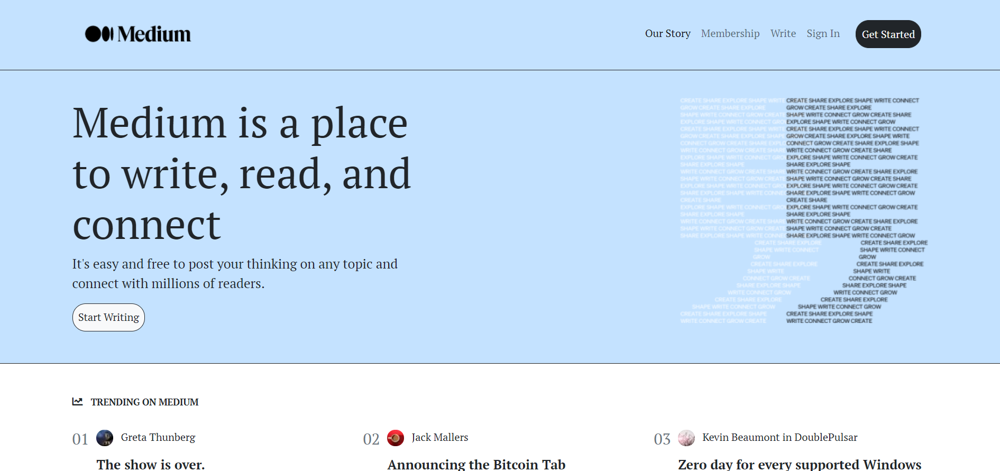
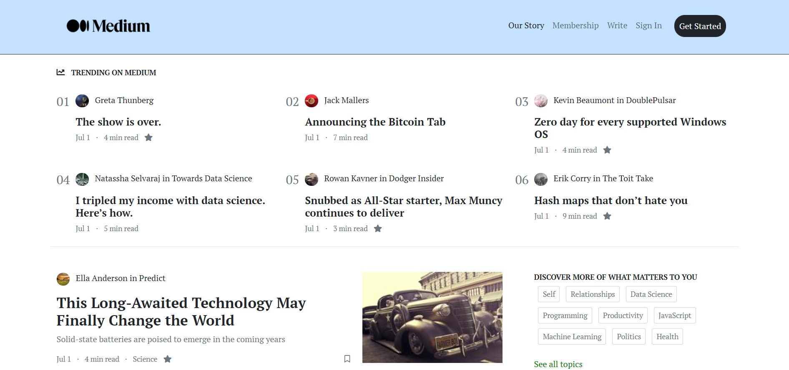
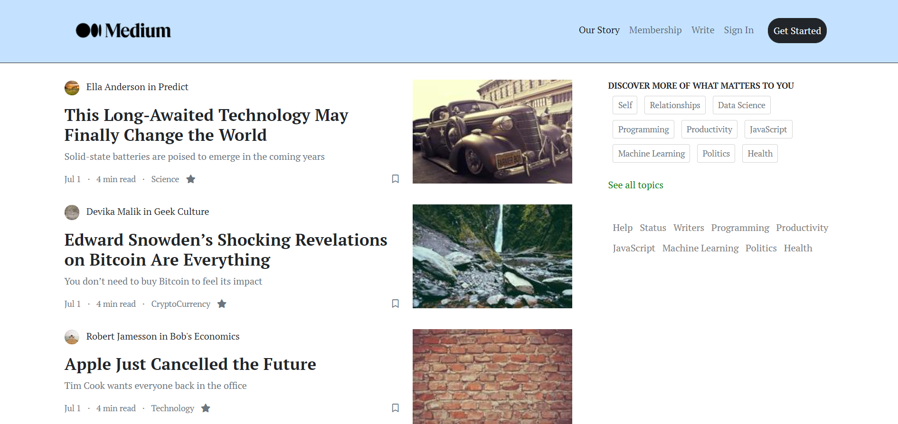
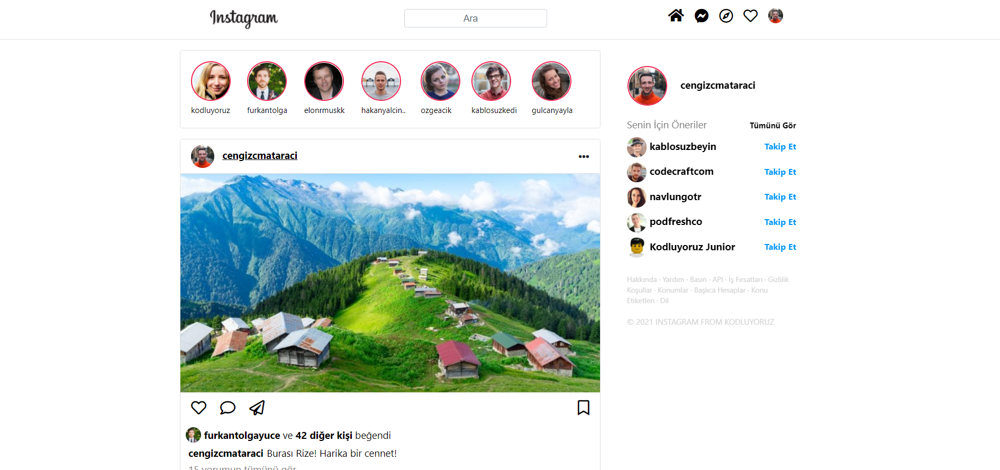
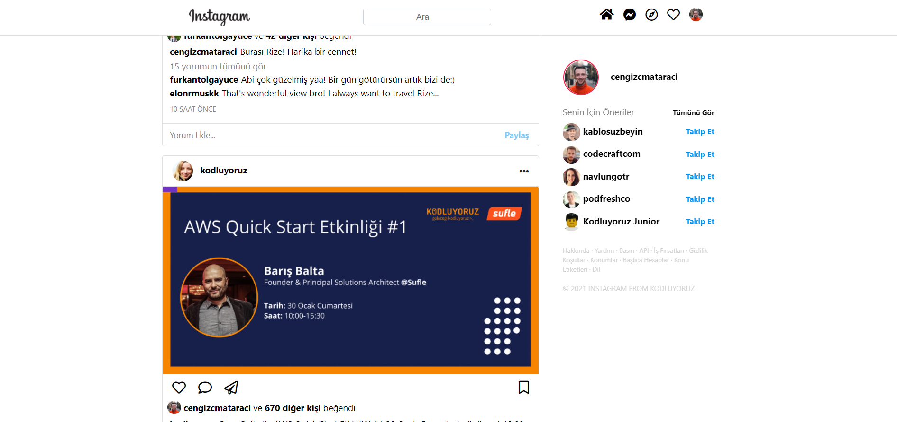
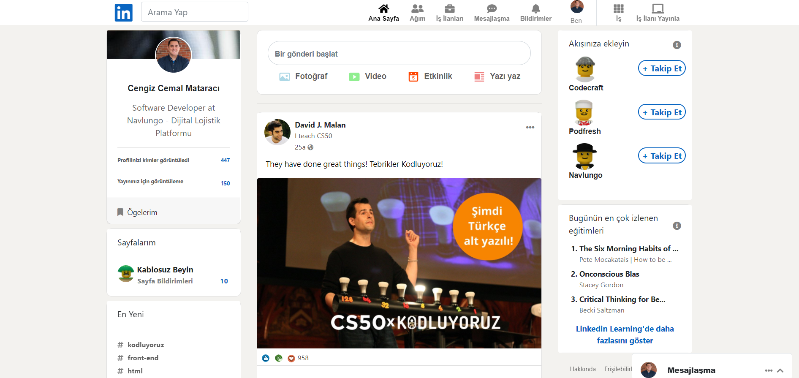
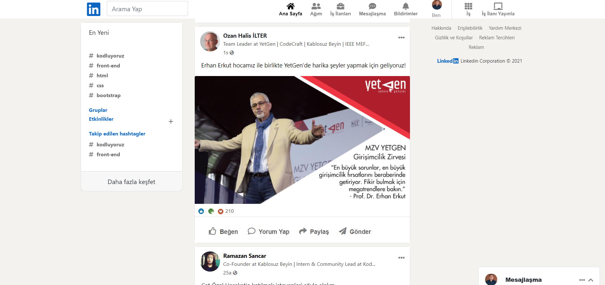

# 💻 Clones with Bootstrap

LinkedIn, medium and instagram clones which were coded with bootstrap. 

To code these clones, I have made use of <a href="https://app.patika.dev/egitimler/frontend-web-development-patikasi">Frontend Web Development Path's tutorials.</a>

# 🎞 Screenshot

## ⭐ <a href="https://medium.com/">Medium</a>

## ⭐ <a href="https://www.instagram.com/">Instagram</a>

## ⭐ <a href="https://www.linkedin.com/">LinkedIn</a>

